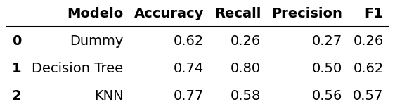

<h1 align="center">📊 Análisis de Evasión de Clientes — Telecom X - Parte 2</h1>

---

## 📋 Tabla de contenidos
1. [📖 Descripción](#-descripción)
2. [🎯 Objetivo del proyecto](#-objetivo-del-proyecto)
3. [🏁 Estado del proyecto](#-estado-del-proyecto)
4. [⚙️ Desarrollo del proyecto](#️-desarrollo-del-proyecto)
5. [📌 Resultados destacados](#-resultados-destacados)
6. [✅ Tecnologías utilizadas](#-tecnologías-utilizadas)
7. [👤 Autor](#-autor)

---

# 📖 Descripción

Este proyecto desarrolla un modelo de **Machine Learning** para predecir la cancelación de clientes (Churn) en una empresa de telecomunicaciones denominada Telecom X.

A partir de un dataset previamente tratado, se realizó:

- Análisis exploratorio de datos (EDA)
- Transformación y codificación de variables
- Balanceo de clases con SMOTE
- Entrenamiento y comparación de distintos modelos supervisados
- Análisis de importancia de variables
- Propuesta de estrategias de retención basadas en los resultados

# 🎯 Objetivo del proyecto

El objetivo principal es:

- Construir modelos capaces de identificar clientes con alta probabilidad de cancelación.
- Comparar el rendimiento de distintos algoritmos.
- Detectar las variables que más influyen en el abandono.
- Traducir los hallazgos en estrategias accionables de retención.

Se priorizó la métrica Recall, dado que el costo asociado a los falsos negativos (clientes que cancelan sin ser detectados) es significativamente mayor que el costo de los falsos positivos. Maximizar el recall permite capturar la mayor cantidad posible de clientes en riesgo, optimizando así las estrategias de retención.

---

## 🏁 Estado del proyecto
🏁 **Proyecto finalizado** 🏁

---

# ⚙️ Desarrollo del proyecto

## 1️⃣ Análisis Exploratorio (EDA)

Se realizaron:

- Matriz de correlación para variables numéricas.
- Countplots segmentados por variable objetivo (Abandono).
- Boxplots para analizar la distribución y dispersión de:
  - Meses de permanencia
  - Cuenta mensual
  - Cargo total

Este análisis permitió detectar patrones preliminares asociados al churn.

---

## 2️⃣ Preprocesamiento

- Eliminación de columnas irrelevantes.
- Separación en conjunto de entrenamiento y prueba.
- Codificación de variables categóricas mediante `OneHotEncoder`.
- Balanceo del conjunto de entrenamiento utilizando **SMOTE**.
- Normalización con `MinMaxScaler` para el modelo KNN.

---

## 3️⃣ Modelos Implementados

### 🔹 DummyClassifier
Modelo base para establecer una línea de comparación.

### 🔹 Decision Tree Classifier
Configuración utilizada:
- `max_depth=4`
- `min_samples_split=2`
- `min_samples_leaf=1`

Entrenado sobre datos balanceados con SMOTE.

### 🔹 K-Nearest Neighbors (KNN)
Configuración utilizada:
- `n_neighbors=15`
- `weights='distance'`

Entrenado sobre datos balanceados y normalizados.

---

## 4️⃣ Métricas Evaluadas

- Accuracy
- Recall
- Precision
- F1-score
- Matrices de confusión

Se utilizó además **Permutation Importance** para evaluar la influencia real de cada variable sobre el rendimiento del modelo.

---

# 📌 Resultados destacados

## 📊 Comparación de modelos

### 🔎 Interpretación

- El modelo Dummy confirma que el problema no puede resolverse prediciendo solo la clase mayoritaria.
- El KNN obtiene la mayor accuracy.
- El Árbol de Decisión logra el mayor recall (0.80).

Desde una perspectiva de negocio, el **Árbol de Decisión resulta el modelo más adecuado**, ya que maximiza la detección de clientes que cancelan.

---

## 🔎 Factores más influyentes en la cancelación

El análisis de importancia de variables mostró como determinantes:

- Tipo_contrato_month-to-month
- Forma_pago_electronic check
- Tipo_servicio_internet_fiber optic
- Meses_permanencia

La modalidad de contrato mensual explica más del 60% de la importancia del modelo de árbol.

---

## 🚀 Estrategias propuestas

### 1️⃣ Incentivar contratos de largo plazo
Promover contratos anuales o bianuales mediante descuentos y beneficios exclusivos.

### 2️⃣ Programa de fidelización temprana
Intervención activa en los primeros 3–6 meses del cliente, especialmente en contratos mes a mes y servicio de fibra óptica.

### 3️⃣ Revisión del segmento fibra óptica
Evaluar calidad percibida, precios y propuesta de valor para este segmento de alto riesgo.

### 4️⃣ Promoción de pagos automáticos
Fomentar métodos de pago automatizados para reducir fricción operativa y probabilidad de abandono.

---

## ✅ Tecnologías utilizadas

### 💬 Lenguaje
- **Python**

### 📚 Librerías principales
- `pandas`
- `numpy`
- `matplotlib`
- `seaborn`
- `Scikit-learn`
- `Imbalanced-learn (SMOTE)`

### 🧩 Entorno de desarrollo
- **Google Colab**

---

## 👤 Autor
**[Jonathan Marino](https://github.com/JonathanMarino)**

📅 Año: 2026  
📍 Proyecto educativo — *Análisis predictivo para retención de clientes* 
